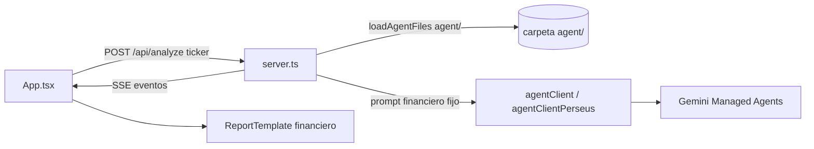
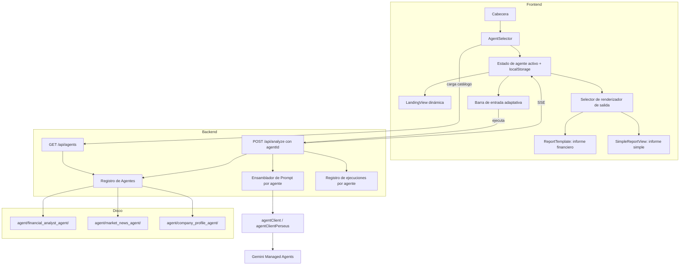
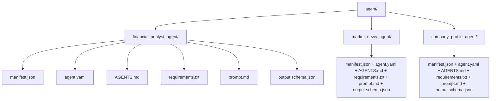
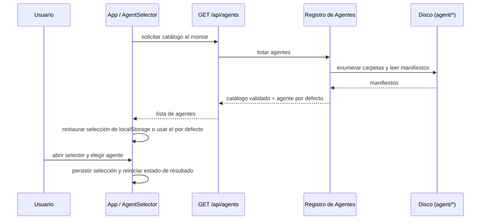
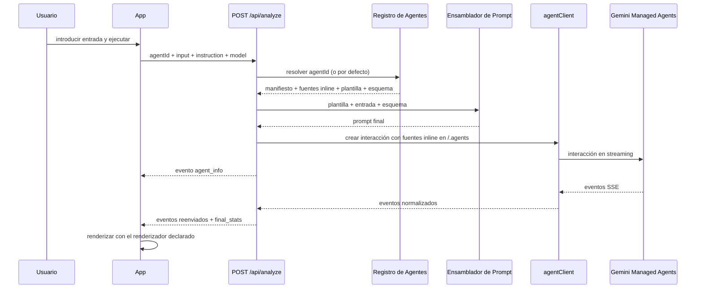

# Documento de Diseño: Selección de Múltiples Agentes

## Overview

Hoy la aplicación Tickr ejecuta un único agente implícito: el servidor lee todos los archivos de `agent/` (`agent.yaml`, `AGENTS.md`, `requirements.txt`), los sube como fuentes inline al entorno remoto en `/.agents` y construye un prompt financiero fijo (con esquema JSON embebido) dentro de `POST /api/analyze`. La interfaz no ofrece ninguna forma de elegir un agente distinto, y el renderizado del resultado está acoplado al esquema del informe financiero (`ReportTemplate`).

Este diseño convierte ese agente único en un **catálogo de agentes descubierto desde el sistema de archivos**. Cada agente vive en su propia carpeta bajo `agent/`, acompañado de un manifiesto que declara su identidad, su metadata visual, el tipo de entrada que espera, la plantilla de prompt que usa y cómo debe renderizarse su salida. El agente actual se traslada a `agent/financial_analyst_agent/` y se marca como agente por defecto. Se añaden dos agentes de ejemplo simples (`market_news_agent` y `company_profile_agent`) que siguen exactamente el mismo patrón: instrucciones en `AGENTS.md`, herramienta `google_search`, salida JSON estructurada.

En el frontend se incorpora un **selector de agentes moderno** en la cabecera: un botón con la identidad del agente activo que abre un panel emergente con tarjetas de agente, alineado con el lenguaje visual existente (fondo `bg-black/20` con `backdrop-blur-md`, bordes `border-white/10`, paleta `stone`, tipografías Instrument Sans/Serif, iconos `lucide-react` y animaciones con `motion`). La selección determina qué carpeta de agente se envía al backend, qué texto de ayuda aparece en la barra de entrada, qué contenido muestra la vista de aterrizaje y qué renderizador presenta el resultado final.

---

## Architecture

### Arquitectura actual (agente único, acoplado)



### Arquitectura propuesta (catálogo de agentes)



### Estructura de carpetas del catálogo



**Decisión de diseño**: la carpeta es la unidad de agente y el nombre de la carpeta es el identificador (`agentId`). No existe ningún registro central en código que haya que editar al añadir un agente; basta con crear una carpeta con su manifiesto. Esto mantiene el patrón que ya usa el proyecto (contenido del agente como archivos, no como constantes en TypeScript).

**Separación entre archivos de ejecución y archivos de metadata**:

| Archivo | Se sube al entorno remoto (`/.agents`) | Uso |
|---|---|---|
| `agent.yaml` | Sí | Configuración del agente gestionado (id, base_agent, tools, environment, examples) |
| `AGENTS.md` | Sí | Instrucciones de comportamiento del agente |
| `requirements.txt` | Sí | Dependencias Python del entorno remoto |
| Subcarpetas adicionales | Sí | Recursos propios del agente (se recorren recursivamente, igual que hoy) |
| `manifest.json` | No | Metadata de catálogo, UI y contrato de entrada/salida |
| `prompt.md` | No | Plantilla del prompt que ensambla el servidor |
| `output.schema.json` | No | Esquema JSON esperado, inyectado en el prompt |

Esta exclusión mantiene el entorno remoto equivalente al actual y evita que el agente confunda la metadata del servidor con instrucciones.

---

## Components and Interfaces

### Backend

#### 1. Registro de Agentes (`server/lib/agentRegistry.ts`)

**Propósito**: descubrir, validar, cachear y exponer el catálogo de agentes disponibles en disco.

**Responsabilidades**:
- Enumerar las subcarpetas de `agent/` y leer el `manifest.json` de cada una.
- Validar cada manifiesto (campos obligatorios, valores permitidos de `inputMode` y `outputRenderer`, existencia de `AGENTS.md`, `prompt.md` y `output.schema.json`).
- Descartar carpetas inválidas registrando una advertencia en consola, sin tumbar el servidor.
- Determinar el agente por defecto: el manifiesto con `isDefault: true`; si hay varios o ninguno, `financial_analyst_agent`; si tampoco existe, el primero por `order` y luego por `id`.
- Resolver un `agentId` a su definición completa (manifiesto + rutas de archivos).
- Cargar los archivos de ejecución del agente como fuentes inline con destino `/.agents`, reutilizando la lógica recursiva que hoy vive en `loadAgentFiles` dentro de `server.ts` (se traslada aquí, aplicando la lista de exclusión de metadata).
- Mantener el catálogo en memoria y refrescarlo cuando cambia la marca de tiempo de modificación de `agent/` (en desarrollo permite añadir agentes sin reiniciar).

**Interfaz conceptual expuesta**: listar catálogo, obtener agente por id, obtener agente por defecto, obtener fuentes inline de un agente, obtener plantilla de prompt y esquema de salida de un agente.

#### 2. Ensamblador de Prompt (`server/lib/promptBuilder.ts`)

**Propósito**: construir el prompt final combinando la plantilla del agente, la entrada del usuario y el esquema de salida declarado.

**Responsabilidades**:
- Sustituir los marcadores de la plantilla (`{{input}}`, `{{instruction}}`, `{{schema}}`) por los valores efectivos de la petición.
- Inyectar el contenido de `output.schema.json` en el bloque de esquema, en lugar del esquema embebido hoy en `server.ts`.
- Aplicar el bloque común de reglas de salida JSON (envoltura en bloque ```json, prohibición de renombrar claves) para todos los agentes, de modo que cada `prompt.md` solo describa lo específico del agente.
- Fallar de forma explícita si la plantilla contiene marcadores no resueltos.

**Nota de diseño**: el prompt largo y específico del análisis financiero que hoy está incrustado en `server.ts` se traslada literalmente a `agent/financial_analyst_agent/prompt.md`, y su esquema a `agent/financial_analyst_agent/output.schema.json`. El comportamiento del agente financiero no cambia.

#### 3. Endpoint de catálogo: `GET /api/agents`

**Propósito**: entregar al frontend la lista de agentes disponibles y cuál es el por defecto.

**Comportamiento**: responde el catálogo ordenado por `order` y luego por `name`, con solo los campos que la UI necesita (nunca rutas de disco ni contenido de prompts). Sin autenticación adicional, igual que el resto de los endpoints actuales.

#### 4. Endpoint de ejecución: `POST /api/analyze` (extendido)

**Propósito**: ejecutar el agente seleccionado.

**Cambios respecto al comportamiento actual**:
- Acepta un campo `agentId` opcional. Si falta o es desconocido, usa el agente por defecto (compatibilidad hacia atrás con clientes existentes).
- Acepta `input` como nombre genérico del valor principal, manteniendo `ticker` como alias aceptado para compatibilidad.
- Valida la entrada según el `inputMode` del agente (`ticker` exige un símbolo corto alfanumérico; `text` exige texto no vacío).
- Carga las fuentes inline de la carpeta del agente resuelto en lugar de la raíz `agent/`.
- Construye el prompt con el Ensamblador de Prompt en lugar del prompt fijo.
- Emite un primer evento SSE de tipo `agent_info` con el `agentId`, el nombre visible y el renderizador de salida, para que el frontend etiquete la ejecución y elija el renderizador aun si el usuario cambia de agente durante el streaming.
- El resto del flujo (cabeceras SSE, reenvío de eventos, `final_stats`, escritura de `run_logs`) se conserva.

#### 5. Registro de ejecuciones (`run_logs`)

**Cambio**: los nombres de archivo incorporan el `agentId` (`run_log_<agentId>_<input>_<runId>.jsonl` y `.txt`), y `GET /api/download_jsonl` acepta un parámetro `agent` opcional para filtrar; sin él, devuelve el log más reciente de cualquier agente para esa entrada. Esto evita que ejecuciones de distintos agentes sobre el mismo ticker se solapen.

### Frontend

#### 6. `AgentSelector` (`src/components/AgentSelector.tsx`)

**Propósito**: permitir elegir el agente activo con un menú moderno consistente con el sitio.

**Responsabilidades**:
- Mostrar un botón compacto en la cabecera con el icono, el nombre del agente activo y un chevron.
- Abrir un panel emergente con una tarjeta por agente: icono, nombre, descripción breve, etiqueta del tipo de entrada y marca de "Predeterminado" cuando corresponda.
- Indicar visualmente el agente seleccionado y deshabilitar el cambio mientras hay una ejecución en curso, con un texto explicativo.
- Cerrar con clic fuera, `Escape` o selección; navegación con teclado (flechas, `Home`/`End`, `Enter`/`Espacio`).
- Mostrar estados de carga y de error del catálogo.

**Estilo** (reutiliza tokens ya presentes en el proyecto):

| Elemento | Tratamiento |
|---|---|
| Botón disparador | `bg-stone-800 border border-stone-700 rounded-lg`, texto `text-stone-100`, `hover:bg-stone-700`, transición de color |
| Panel emergente | `bg-black/20 backdrop-blur-md border border-white/10 rounded-xl shadow-2xl`, igual que las tarjetas de `LandingView` y `AgentTimeline` |
| Tarjeta de agente | Fila con icono en círculo `bg-white/10`, título `text-sm font-medium text-white`, descripción `text-xs text-white/60`, separadores `h-px bg-white/10` |
| Agente activo | Borde de acento del agente y check (`CheckCircle2`) a la derecha |
| Animación | `motion` con entrada `opacity/y/scale` y salida vía `AnimatePresence`, replicando `TimelineItem` |
| Tipografía | `font-sans` para cuerpo; nombre del agente en `font-display` en el disparador, siguiendo el logotipo "Tickr" |

#### 7. Estado de agente en `App.tsx`

**Responsabilidades**:
- Cargar el catálogo al montar y fijar el agente activo: valor válido en `localStorage` (clave `tickr.selectedAgentId`), si no el agente por defecto del catálogo.
- Persistir la selección al cambiar.
- Reiniciar el estado de resultado (`reportData`, `events`, métricas, error) al cambiar de agente, para no mezclar salidas de agentes distintos.
- Pasar el `agentId` en el cuerpo de `POST /api/analyze`.
- Conservar el `agentId` de la ejecución en curso, junto con su renderizador, para decidir cómo mostrar el resultado.
- Sustituir la etiqueta fija "Gemini 3.6 Flash" de la cabecera del panel de ejecución por el nombre del agente activo, manteniendo el nombre del modelo como texto secundario.

#### 8. `LandingView` dinámica

**Cambio**: pasa de contenido financiero fijo a contenido derivado del agente activo. El manifiesto aporta título, subtítulo y dos bloques de puntos destacados (`highlights`), que se renderizan con la misma composición de dos tarjetas ya existente. El agente financiero conserva su texto actual.

#### 9. Barra de entrada adaptativa

**Cambio**: el campo con etiqueta `TICKER` y el campo de instrucción deshabilitado se sustituyen por un grupo cuyo comportamiento depende del `inputMode` del manifiesto:

| `inputMode` | Presentación | Validación |
|---|---|---|
| `ticker` | Campo corto en mayúsculas y monoespaciado, icono `Search`, más campo de instrucción opcional | Símbolo de 1 a 10 caracteres alfanuméricos |
| `text` | Campo ancho de texto libre con el `inputPlaceholder` del manifiesto | Texto no vacío tras recortar espacios |

El botón de acción usa la etiqueta declarada por el agente (`actionLabel`, por ejemplo "Analyze", "Resumir noticias", "Generar perfil"), y el aviso legal inferior se mantiene.

#### 10. Renderizadores de salida

| Renderizador | Componente | Uso |
|---|---|---|
| `financial_report` | `ReportTemplate` existente | Agente analista financiero; sin cambios en su contrato de props |
| `simple_report` | `SimpleReportView` nuevo (`src/components/SimpleReportView.tsx`) | Agentes de ejemplo; muestra resumen, lista de puntos clave, secciones y fuentes con `FormattedMarkdown`, con la misma estética de tarjetas |

La elección del renderizador proviene del manifiesto del agente que produjo el resultado, no del agente actualmente seleccionado.

#### 11. Extracción de resultado por agente

**Cambio**: la función de parseo del texto final en `App.tsx` valida hoy la presencia de `verdict`, `findings` o `deep_insights` (esquema financiero). Se generaliza para aceptar el conjunto de claves raíz esperadas según el renderizador del agente en ejecución (`summary`, `key_points`, `sections`, `sources` para `simple_report`), conservando la estrategia actual de búsqueda del último bloque ```json válido con degradación a búsqueda de llaves.

---

## Data Models

### Manifiesto de agente (`agent/<id>/manifest.json`)

| Campo | Tipo | Obligatorio | Descripción |
|---|---|---|---|
| `id` | texto | Sí | Identificador estable; debe coincidir con el nombre de la carpeta (snake_case) |
| `name` | texto | Sí | Nombre visible en el selector |
| `tagline` | texto | Sí | Descripción de una línea para la tarjeta del selector |
| `description` | texto | Sí | Descripción más larga para la vista de aterrizaje |
| `icon` | texto | Sí | Nombre de un icono de `lucide-react` (validado contra una lista permitida) |
| `accentColor` | texto | No | Color hexadecimal de acento para bordes y detalles; por defecto blanco translúcido |
| `order` | entero | No | Orden en el selector; por defecto 100 |
| `isDefault` | booleano | No | Marca el agente por defecto del catálogo |
| `inputMode` | enum `ticker` \| `text` | Sí | Tipo de entrada principal |
| `inputPlaceholder` | texto | Sí | Texto de ayuda del campo de entrada |
| `actionLabel` | texto | Sí | Etiqueta del botón de ejecución |
| `outputRenderer` | enum `financial_report` \| `simple_report` | Sí | Componente de presentación del resultado |
| `promptFile` | texto | No | Plantilla de prompt; por defecto `prompt.md` |
| `schemaFile` | texto | No | Esquema de salida; por defecto `output.schema.json` |
| `landing` | objeto | No | `title`, `subtitle` y dos grupos de `highlights` para la vista de aterrizaje |
| `supportsInstruction` | booleano | No | Habilita el campo de instrucción adicional; por defecto falso |

### Resumen de agente entregado por `GET /api/agents`

| Campo | Origen |
|---|---|
| `id`, `name`, `tagline`, `description`, `icon`, `accentColor`, `order`, `isDefault` | Manifiesto |
| `inputMode`, `inputPlaceholder`, `actionLabel`, `supportsInstruction` | Manifiesto |
| `outputRenderer` | Manifiesto |
| `landing` | Manifiesto |
| `defaultAgentId` (a nivel de respuesta) | Resuelto por el Registro de Agentes |

No se exponen rutas de disco, contenido de `prompt.md`, `AGENTS.md` ni el esquema.

### Petición de `POST /api/analyze`

| Campo | Tipo | Obligatorio | Notas |
|---|---|---|---|
| `agentId` | texto | No | Ausente o desconocido ⇒ agente por defecto |
| `input` | texto | Sí | Valor principal; `ticker` se acepta como alias heredado |
| `instruction` | texto | No | Solo se usa si el agente declara `supportsInstruction` |
| `origin` | texto | No | Igual que hoy |
| `model` | texto | No | `perseus` selecciona el cliente alternativo; cualquier otro valor usa el cliente por defecto |

### Evento SSE `agent_info`

| Campo | Descripción |
|---|---|
| `type` | Constante `agent_info` |
| `agentId` | Agente resuelto para la ejecución |
| `agentName` | Nombre visible |
| `outputRenderer` | Renderizador que debe usar el frontend |

Los tipos de evento existentes (`thinking`, `text`, `tool_call`, `tool_result`, `complete`, `error`, `done`, `final_stats`) se mantienen sin cambios.

### Contrato de salida `simple_report`

| Campo | Tipo | Descripción |
|---|---|---|
| `summary` | texto Markdown | Resumen ejecutivo breve |
| `key_points` | lista de textos Markdown | De 3 a 6 puntos clave |
| `sections` | lista de objetos `title` + `body` | Bloques temáticos del informe |
| `sources` | lista de objetos `title` + `url` + `date` | Fuentes consultadas |

El contrato `financial_report` es el esquema actual (`verdict`, `deep_insights`, `findings`, `financial_charts`) y no se modifica.

---

## Catálogo Inicial de Agentes

| Carpeta | Nombre visible | Propósito | `inputMode` | Salida | Herramientas |
|---|---|---|---|---|---|
| `financial_analyst_agent` | Financial Analyst | Busca y sintetiza presentaciones SEC y documentos públicos (comportamiento actual, trasladado sin cambios funcionales) | `ticker` | `financial_report` | `google_search` |
| `market_news_agent` | Market News Digest | Resume las noticias recientes de una empresa o ticker y evalúa el tono general del ciclo noticioso | `ticker` | `simple_report` | `google_search` |
| `company_profile_agent` | Company Profile | Genera un perfil corporativo: modelo de negocio, segmentos, competidores y riesgos estructurales | `text` | `simple_report` | `google_search` |

Los dos agentes nuevos replican el patrón del analista financiero: `agent.yaml` con `base_agent: antigravity-preview-05-2026`, entorno remoto sin fuentes preconfiguradas y `google_search` como única herramienta; `AGENTS.md` con reglas de espacio de trabajo, flujo de trabajo, reglas anti-alucinación y formato de salida; `requirements.txt` con las mismas dependencias mínimas; `prompt.md` y `output.schema.json` conformes al contrato `simple_report`.

---

## Diagramas de Secuencia

### Carga del catálogo y selección



### Ejecución de un agente seleccionado



---

## Correctness Properties

*Una propiedad es una característica o comportamiento que debe cumplirse en todas las ejecuciones válidas del sistema: un enunciado formal sobre lo que el sistema debe hacer. Las propiedades conectan la especificación legible por personas con garantías de corrección verificables por máquina.*

### Property 1: Descubrimiento completo del catálogo

Para toda subcarpeta de `agent/` que contenga un manifiesto válido, el catálogo devuelto por `GET /api/agents` incluye exactamente una entrada con ese identificador, y añadir una carpeta válida basta para que aparezca sin cambios en código.

**Validates: Requirements 1.1, 1.2, 1.11, 17.1**

### Property 2: Aislamiento del contexto del agente

Para toda ejecución con agente resuelto A, el conjunto de fuentes inline enviadas al entorno remoto proviene únicamente de la carpeta de A, preserva la ruta relativa bajo `/.agents` y excluye los archivos de metadata del servidor (`manifest.json`, archivo de prompt, archivo de esquema).

**Validates: Requirements 6.1, 6.2, 6.3**

### Property 3: Resolución total del agente

Para todo valor de `agentId` recibido (ausente, vacío, desconocido o válido), la ejecución se asocia a exactamente un agente del catálogo; nunca queda sin agente ni con más de uno.

**Validates: Requirements 5.1, 5.2**

### Property 4: Unicidad del agente por defecto

Para todo catálogo no vacío existe exactamente un agente marcado como por defecto, y coincide con el resultado de la regla de precedencia (único `isDefault`, luego `financial_analyst_agent`, luego el mínimo por `order` e identificador), independientemente de cuántos manifiestos declaren `isDefault`.

**Validates: Requirements 3.1, 3.2, 3.3, 3.4, 3.6, 3.7**

### Property 5: Identidad estable del identificador

Para todo agente del catálogo, su identificador coincide con el nombre de su carpeta y es único dentro del catálogo.

**Validates: Requirements 1.2, 1.3, 1.11**

### Property 6: Persistencia idempotente de la selección

Para toda selección de agente seguida de una recarga de la página, el agente activo restaurado es el mismo si sigue existiendo en el catálogo; si desapareció, se restaura el agente por defecto y el valor almacenado se sobrescribe.

**Validates: Requirements 12.1, 12.2, 12.3**

### Property 7: Coherencia de renderizado

Para todo resultado mostrado, el renderizador utilizado es el declarado por el agente que produjo ese resultado, incluso si el usuario cambió de selección después de iniciar la ejecución.

**Validates: Requirements 14.1, 14.2**

### Property 8: Ausencia de contaminación entre agentes

Para todo estado de resultado previo y todo cambio de agente activo, el informe, los eventos, las métricas y el error previos quedan vacíos antes de la siguiente ejecución.

**Validates: Requirements 12.4**

### Property 9: Compatibilidad hacia atrás

Para toda petición con el formato anterior (solo `ticker`, sin `agentId`), el agente resuelto es `financial_analyst_agent` y sus fuentes inline, plantilla y esquema son los archivos trasladados a su carpeta (`agent.yaml`, `AGENTS.md`, `requirements.txt`, `prompt.md`, `output.schema.json`); y para toda combinación de `input` y `ticker`, el valor de entrada efectivo es `input` cuando contiene al menos un carácter tras recortar los espacios, y `ticker` en cualquier otro caso.

**Validates: Requirements 9.1, 9.2, 9.3**

### Property 10: Validación previa a la ejecución

Para toda entrada que no cumpla el `inputMode` del agente resuelto, la petición se rechaza con un error de validación y no se cargan fuentes inline, no se ensambla prompt ni se crea ninguna interacción remota.

**Validates: Requirements 8.1, 8.2, 8.3, 8.4**

### Property 11: Robustez del catálogo

Para toda carpeta con manifiesto inválido o incompleto (JSON mal formado, campo obligatorio ausente, valor de enumeración no permitido, icono fuera de la lista permitida, identificador desajustado o archivo requerido ausente), el catálogo omite esa carpeta, registra una advertencia y las demás entradas siguen disponibles.

**Validates: Requirements 1.3, 1.4, 1.5, 1.6, 2.1, 2.2, 2.3, 2.4, 2.5, 9.9, 16.4**

### Property 12: Trazabilidad de ejecuciones

Para toda ejecución, los nombres de los archivos de log generados siguen el patrón declarado e incluyen el identificador del agente que la ejecutó, y la URL emitida en `final_stats` apunta al archivo `.jsonl` de esa ejecución.

**Validates: Requirements 10.1, 10.2**

### Property 13: Superficie mínima del catálogo

Para todo agente del catálogo, la respuesta de `GET /api/agents` contiene exactamente los campos de resumen declarados y no contiene rutas del sistema de archivos ni el contenido de `AGENTS.md`, del archivo de prompt o del archivo de esquema.

**Validates: Requirements 4.2, 4.5, 16.3**

### Property 14: Valores por defecto del manifiesto

Para todo manifiesto válido que omita campos opcionales, la entrada de catálogo resultante toma los valores por defecto declarados (`order` 100, `isDefault` falso, `supportsInstruction` falso, `prompt.md`, `output.schema.json`, acento blanco translúcido).

**Validates: Requirements 2.6**

### Property 15: Orden total del catálogo

Para todo catálogo, la lista devuelta está ordenada de forma no decreciente por `order`, ante empate por `name` en orden alfabético sin distinguir mayúsculas y minúsculas, y ante empate de `name` por agentId ascendente.

**Validates: Requirements 1.8**

### Property 16: Ensamblado completo del prompt

Para todo agente, toda entrada y todo esquema, el prompt ensamblado sustituye `{{input}}`, `{{instruction}}` y `{{schema}}` por sus valores efectivos, incluye el contenido literal del archivo de esquema y contiene el bloque común de reglas de salida JSON.

**Validates: Requirements 7.1, 7.2, 7.3**

### Property 17: Los marcadores sin resolver detienen la ejecución

Para toda plantilla que contenga un marcador con la forma `{{...}}` no soportado, el ensamblado falla con un error que nombra el marcador y no se crea ninguna interacción remota.

**Validates: Requirements 7.4, 7.5**

### Property 18: Tratamiento de la instrucción según el manifiesto

Para toda instrucción recibida y todo agente, la instrucción aparece en el prompt final si y solo si ese agente declara `supportsInstruction` verdadero.

**Validates: Requirements 5.7, 7.6**

### Property 19: Contención de rutas del identificador de agente

Para todo valor de `agentId` recibido, incluidos los que contienen separadores de ruta, secuencias de recorrido de directorios o caracteres fuera de snake_case, la ruta de archivos utilizada queda dentro de la carpeta de un agente descubierto y los valores no coincidentes se tratan como desconocidos.

**Validates: Requirements 16.1, 16.2**

### Property 20: Selección del log más reciente

Para todo conjunto de archivos de log y toda combinación de parámetros de descarga, la respuesta corresponde al archivo `.jsonl` con la marca de tiempo mayor entre los que cumplen los filtros de entrada y, cuando se indica, de agente.

**Validates: Requirements 10.3, 10.4**

### Property 21: Fidelidad del selector a la identidad del agente

Para todo catálogo y todo agente activo, el disparador y la cabecera muestran el nombre y el icono de ese agente junto al nombre del modelo, el panel presenta una tarjeta por agente con su nombre, su descripción breve y la etiqueta de su tipo de entrada, la marca de predeterminado aparece solo en el agente por defecto y exactamente una tarjeta queda marcada como seleccionada.

**Validates: Requirements 11.1, 11.2, 11.3, 12.7**

### Property 22: Bloqueo del cambio durante una ejecución

Para todo catálogo, mientras hay una ejecución en curso ninguna selección de agente modifica el agente activo.

**Validates: Requirements 11.4**

### Property 23: Adaptación de la interfaz al manifiesto

Para todo agente activo, la vista de aterrizaje, el tipo de campo de entrada, su texto de ayuda, la presencia del campo de instrucción, la etiqueta del botón y su estado habilitado se derivan de los valores del manifiesto de ese agente.

**Validates: Requirements 8.7, 8.8, 13.1, 13.2, 13.3, 13.4, 13.5, 13.6, 13.7**

### Property 24: Extracción de resultado del texto final

Para todo texto final, la extracción devuelve el objeto contenido en el último bloque ```json válido cuyas claves raíz corresponden al renderizador de la ejecución, degradando a la búsqueda por llaves exteriores; y si no existe tal objeto, no se promueve ningún informe y el texto crudo se conserva.

**Validates: Requirements 14.4, 14.5, 14.6**

### Property 25: Completitud del informe simple

Para todo objeto conforme al contrato `simple_report`, la vista renderizada contiene el resumen, todos los puntos clave, el título y el cuerpo de todas las secciones y todas las fuentes.

**Validates: Requirements 14.3**

### Property 26: Reconciliación de la selección con la ejecución

Para toda ejecución, la petición lleva el identificador del agente activo y, si el evento `agent_info` informa un identificador distinto, el agente activo pasa a ser el informado y queda almacenado.

**Validates: Requirements 12.5, 12.6**

### Property 27: Salida del modelo sin HTML ejecutable

Para todo contenido devuelto por un agente, el renderizado no inserta HTML ni scripts ejecutables procedentes de ese contenido.

**Validates: Requirements 14.7**

### Property 28: Conformidad del esquema de informe simple

Para todo agente del catálogo con `outputRenderer` igual a `simple_report`, su archivo de esquema declara los campos `summary`, `key_points`, `sections` con `title` y `body`, y `sources` con `title`, `url` y `date`.

**Validates: Requirements 15.5**

---

## Error Handling

### Carpeta de agente inválida o incompleta

**Condición**: falta `manifest.json`, el JSON está mal formado, faltan campos obligatorios, `inputMode`/`outputRenderer` tienen valores no permitidos, o no existen `AGENTS.md`, `prompt.md` o `output.schema.json`.
**Respuesta**: el Registro de Agentes omite la carpeta y registra una advertencia con el motivo y la ruta.
**Recuperación**: el resto del catálogo se sirve con normalidad; corregir la carpeta y refrescar la basta para reincorporarla.

### Catálogo vacío

**Condición**: no hay ninguna carpeta de agente válida.
**Respuesta**: `GET /api/agents` devuelve una lista vacía; `POST /api/analyze` responde error de configuración del servidor.
**Recuperación**: el selector muestra un estado vacío explicativo y el botón de ejecución queda deshabilitado.

### `agentId` desconocido

**Condición**: el cliente envía un identificador que no está en el catálogo (por ejemplo, una selección persistida de un agente eliminado).
**Respuesta**: el servidor ejecuta el agente por defecto y lo comunica en el evento `agent_info`.
**Recuperación**: el frontend actualiza la selección activa al agente informado y persiste el cambio.

### Entrada inválida para el `inputMode`

**Condición**: ticker vacío o con formato incorrecto, o texto vacío.
**Respuesta**: error de validación antes de contactar el servicio remoto, con mensaje específico del campo.
**Recuperación**: el frontend valida en cliente y deshabilita el botón; el servidor repite la validación como red de seguridad.

### Fallo al cargar el catálogo en el frontend

**Condición**: `GET /api/agents` falla o no responde.
**Respuesta**: el selector muestra un estado de error con opción de reintento y la aplicación continúa con el agente por defecto conocido.
**Recuperación**: reintento manual; la ejecución sigue siendo posible porque el servidor resuelve el por defecto.

### Salida que no cumple el contrato del agente

**Condición**: el modelo devuelve JSON que no encaja con el renderizador declarado.
**Respuesta**: el resultado no se promueve a informe; la línea de tiempo conserva el texto crudo del agente, igual que hoy, y se muestra un aviso de que no se pudo estructurar el informe.
**Recuperación**: el usuario puede reejecutar; los logs `.jsonl` quedan disponibles para inspección.

### Cambio de agente durante una ejecución

**Condición**: el usuario intenta cambiar de agente con `running` activo.
**Respuesta**: el selector bloquea el cambio con un mensaje explicativo; la ejecución en curso no se ve afectada.
**Recuperación**: el cambio queda disponible al terminar o detener la ejecución.

---

## Testing Strategy

### Pruebas unitarias

- Registro de Agentes: descubrimiento de carpetas, validación de manifiestos, resolución del agente por defecto (uno, varios, ninguno), exclusión de archivos de metadata en las fuentes inline, comportamiento con `agentId` desconocido.
- Ensamblador de Prompt: sustitución de marcadores, inyección del esquema, error ante marcadores no resueltos, equivalencia del prompt del agente financiero con el prompt previo.
- Validación de entrada por `inputMode`.
- Extracción de resultado: JSON financiero, JSON de informe simple, texto sin JSON, múltiples bloques JSON.

### Pruebas basadas en propiedades

**Biblioteca**: `fast-check` (TypeScript, coherente con el stack actual).

Se implementa una prueba por cada propiedad de la sección "Correctness Properties" (Propiedades 1 a 28), con un mínimo de 100 iteraciones por propiedad y una etiqueta que referencia la propiedad del diseño. Los generadores cubren catálogos aleatorios en disco temporal, manifiestos parcial o totalmente corruptos, identificadores arbitrarios (incluidos intentos de recorrido de rutas), entradas de usuario arbitrarias y textos finales con ruido y múltiples bloques JSON. El cliente remoto se sustituye por un doble de prueba para que las propiedades no dependan del servicio de Gemini.

Los criterios de aceptación clasificados como integración, humo o caso límite en el prework (configuración estática, contenido concreto del repositorio, estados puntuales de interfaz, modelo de acceso) se cubren con pruebas de ejemplo o revisión manual, no con pruebas basadas en propiedades.

### Pruebas de integración

- `GET /api/agents` devuelve las tres carpetas del catálogo inicial con el analista financiero como por defecto.
- `POST /api/analyze` sin `agentId` reproduce el flujo actual (mismo agente, mismo esquema).
- `POST /api/analyze` con cada uno de los tres agentes emite `agent_info` con el renderizador correcto y produce archivos de log con el identificador del agente.

### Pruebas manuales de interfaz

- Abrir y cerrar el selector con ratón, teclado y clic exterior.
- Cambiar de agente y verificar que la vista de aterrizaje, el marcador de posición de entrada y la etiqueta del botón se actualizan.
- Ejecutar cada agente y verificar el renderizador de salida correspondiente.
- Verificar el bloqueo del selector durante una ejecución.

---

## Performance Considerations

- El catálogo se lee del disco una vez y se mantiene en memoria; se revalida solo cuando cambia la marca de tiempo de `agent/`, evitando lecturas por petición.
- El contenido pesado (instrucciones, plantillas, esquemas) se carga de forma diferida al ejecutar un agente, no al listar el catálogo, de modo que `GET /api/agents` sigue siendo una respuesta pequeña.
- Las fuentes inline enviadas al entorno remoto se reducen a los archivos de un solo agente, por lo que la carga útil no crece al añadir agentes al catálogo.
- El panel del selector renderiza un número reducido de tarjetas y no requiere virtualización; las animaciones reutilizan `motion`, ya presente en el bundle.

---

## Security Considerations

- **Recorrido de rutas**: el `agentId` se valida contra la lista de identificadores descubiertos y nunca se concatena directamente a una ruta; solo se aceptan identificadores en snake_case sin separadores de ruta.
- **Superficie de información**: el catálogo público no expone rutas del sistema de archivos ni el contenido de instrucciones, prompts o esquemas.
- **Confianza en el contenido del agente**: los archivos de `agent/` forman parte del repositorio y se tratan como contenido de confianza del proyecto; el manifiesto se valida por esquema y el icono se limita a una lista permitida para evitar inyección de nombres arbitrarios en la UI.
- **Autenticación**: los endpoints nuevos siguen el modelo actual del proyecto, que no aplica autorización en `/api/*` aunque exista sesión de Cognito en el cliente. Esto significa que el catálogo y la ejecución de agentes quedan accesibles sin autenticación; conviene decidir explícitamente en la fase de requisitos si `POST /api/analyze` y `GET /api/agents` deben exigir un token válido antes de exponer la aplicación públicamente.
- **Salida del modelo**: el contenido devuelto por los agentes se sigue tratando como no confiable y se renderiza mediante el componente Markdown existente, sin ejecución de HTML arbitrario.

---

## Compatibilidad y Migración

- El traslado de `agent/agent.yaml`, `agent/AGENTS.md` y `agent/requirements.txt` a `agent/financial_analyst_agent/` no deja archivos de agente en la raíz de `agent/`; cualquier carpeta sin manifiesto se ignora.
- `POST /api/analyze` mantiene el alias `ticker` y el comportamiento por defecto, por lo que un cliente sin cambios sigue funcionando.
- `GET /api/download_jsonl` mantiene su parámetro `ticker` y añade `agent` como opcional.
- Los logs históricos con el nombre anterior siguen siendo servidos por el estático `/run_logs`.
- La documentación del proyecto (`README.md`, `overview.md`) se actualiza para describir el catálogo de agentes y cómo añadir uno nuevo.

---

## Dependencies

- Sin dependencias nuevas de tiempo de ejecución. El manifiesto usa JSON, que se lee con las utilidades nativas ya empleadas en `server.ts`; el `agent.yaml` sigue siendo consumido por el servicio remoto, no por el servidor.
- Frontend: `react`, `lucide-react` (iconos), `motion` (animaciones), Tailwind CSS v4 con los tokens definidos en `src/index.css`; todas ya presentes.
- Backend: `express` y las utilidades de sistema de archivos de Node; los clientes `agentClient` y `agentClientPerseus` se reutilizan sin cambios de firma.
- Pruebas: `fast-check` como dependencia de desarrollo para las pruebas basadas en propiedades (el proyecto aún no tiene un ejecutor de pruebas configurado; será necesario añadir uno en la fase de tareas).
